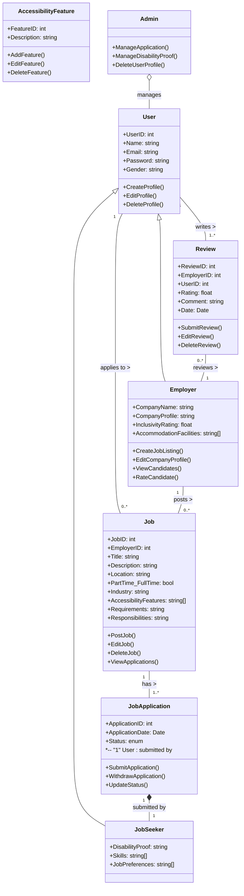

# IncluWork-final project

## Description
IncluWork is a full stack web application aimed at providing job opportunities to differently abled individuals, addressing human rights and equality issues as outlined by the UN. The platform facilitates employment by connecting job seekers with inclusive employers who offer accommodations and support services to create an accessible work environment. Job seekers can create profiles, while employers can post job listings and review candidates. Admin verification ensures that disability proofs provided by job seekers are valid before completing job applications. The system matches job seeker skills with employer job preferences to enhance job placement.

## Users
IncluWork targets two main user groups:
- **Job Seekers**: Differently abled individuals looking for employment opportunities. They can create profiles, search for jobs, and apply to positions that match their skills and preferences.
- **Employers**: Companies committed to diversity and inclusivity, offering job opportunities and accommodations for differently abled individuals. Employers can post job listings, review candidates and receive inclusivity rating.

## Technologies Used
- **Frontend**: Utilizing React.js, a powerful library for crafting dynamic and engaging user interfaces.
- **Backend**: Employing Node.js in conjunction with Express.js to manage server-side operations and develop robust APIs.
- **Database**: Leveraging MongoDB, a flexible and scalable NoSQL database, to store diverse user data, environmental statistics, and content efficiently.

## Feature Highlights
- **User Profiles**: Job seekers and employers can create and manage their profiles, showcasing their skills, preferences, and company details.
- **Job Listings**: Employers can post job listings, specifying job requirements and accommodations for differently abled individuals.
- **Application Management**: Job seekers can apply to job listings, and employers can manage applications, review candidates, and rate inclusivity.
- **Admin Verification**: Admin verifies disability proofs provided by job seekers to ensure the authenticity of applications.

## Addressing Global Issues
IncluWork directly addresses global issues related to human rights and equality, particularly focusing on the employment of differently abled individuals. By providing a platform where job seekers and inclusive employers can connect, the application promotes diversity and inclusivity in the workforce, aligning with the UN's initiatives for equal opportunities and rights for all individuals.

## Object Model (Mermaid Code)

## Team Members

- **Apurva Raj**
  - Email: apurvaraj9808@gmail.com

- **Malini Janaki Sankaran**
  - Email: janakisankaran.m@northeastern.edu

- **Soumya Ganesh**
  - Email: ganesh.so@northeastern.edu

- **Vamsi Krishna Poluru**
  - Email: poluru.va@northeastern.edu

